# System Design: Sync Architecture for Conversation RAG

## Overview

The system is split into two layers: an **on-device layer** for fast, private, offline access and a **cloud layer** for persistence and cross-device sync.



---

## On-Device Storage

| Data | Format | Why Local |
|---|---|---|
| Conversation messages | SQLite | Fast lookup, offline access |
| Message embeddings | `.pkl` / FAISS index | Expensive to recompute |
| Intent classifier model | `model.safetensors` (~18MB) | Must run offline, <200ms |
| Persona JSON | SQLite | Private user data |
| Drift timeline | SQLite | Derived from local personas |
| ChromaDB vector store | Local folder | Enables offline RAG queries |

Everything needed to answer a query runs fully offline. No API call is required for retrieval or intent classification.

---

## Cloud Storage

| Data | Format | Why Cloud |
|---|---|---|
| Raw conversations (new) | Compressed JSON | Backup + cross-device sync |
| Topic summaries | JSON | Expensive to regenerate (LLM calls) |
| Persona snapshots | JSON | Shareable across devices |
| Drift timeline | JSON | Lightweight, useful on all devices |

The cloud does **not** store raw embeddings — these are recomputed on-device after sync since they are large (~1GB for 56k conversations) and device-specific.

---

## Sync Architecture

```
┌─────────────────────────────────┐
│           DEVICE                │
│                                 │
│  SQLite (messages, personas)    │
│  ChromaDB (vectors)             │◄──── query at runtime
│  Intent Model (offline)         │
│  Drift Timeline                 │
│         │                       │
│         │ sync (delta only)     │
│         ▼                       │
│    Sync Queue (local)           │
└──────────┬──────────────────────┘
           │ HTTPS (on WiFi or manual trigger)
           ▼
┌─────────────────────────────────┐
│           CLOUD                 │
│                                 │
│  Object Storage (S3/GCS)        │
│  - raw conversations (new only) │
│  - topic summaries              │
│  - persona snapshots            │
│                                 │
│  Metadata DB (Postgres)         │
│  - conversation_id              │
│  - last_synced_at               │
│  - device_id                    │
└─────────────────────────────────┘
```

---

## What Syncs, What Stays Local

### Stays local only
- Raw embeddings (too large, recomputed on device)
- ChromaDB vector index (rebuilt after sync)
- Intent classifier weights (static, shipped with app)

### Syncs to cloud
- New raw conversations (delta sync — only unseen rows)
- Topic summaries (generated by LLM, expensive to redo)
- Persona JSON per conversation
- Drift timeline entries

### Syncs from cloud to device
- New conversations added on another device
- Updated summaries or personas

---

## Conflict Resolution

Conflicts arise when the same conversation is modified on two devices before syncing.

**Strategy: Last-Write-Wins with flagging**

1. Every record has a `last_modified_at` timestamp and `device_id`
2. On sync, compare timestamps — newer record wins
3. If timestamps are within 60 seconds (true conflict), both versions are kept and flagged for manual review
4. Personas and drift timelines are **append-only** — new entries never overwrite old ones, they extend the timeline

**Example conflict:**
```
Device A: updates persona for conversation_42 at 10:00:01
Device B: updates persona for conversation_42 at 10:00:03
→ Device B wins (newer), Device A version archived
```

---

## Key Design Decisions

**Why SQLite on device?**
Lightweight, zero-config, works offline, fast for structured queries like "get all personas for days 1-30".

**Why not sync embeddings?**
A full embedding matrix for 56k conversations is ~1-2GB. Syncing this would be slow and expensive. Instead, embeddings are recomputed locally after new conversations sync down — this takes minutes, not hours, for delta updates.

**Why delta sync only?**
The full dataset is large. Only syncing new/changed records keeps sync fast (seconds, not minutes) and reduces bandwidth.

**Why append-only for personas and drift?**
Personas evolve over time — overwriting old data loses the drift signal. Keeping all versions enables the timeline feature.
